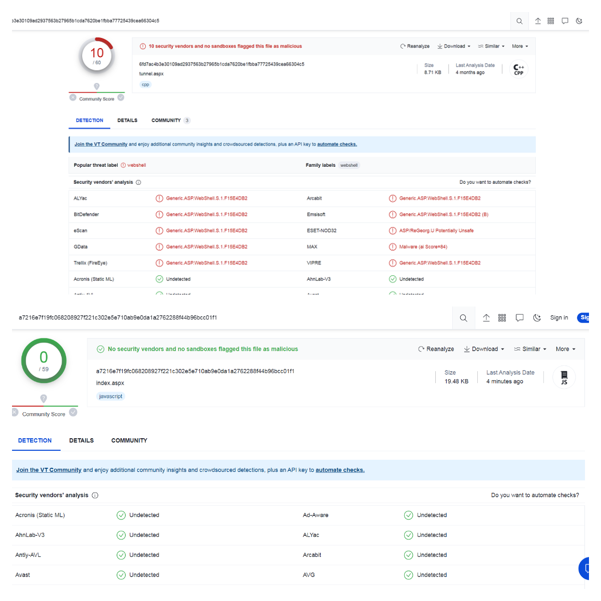

# BypassNeo-reGeorg


# 免杀效果

> 对于默认生成的php和jsp，Neo-reGeorg自身免杀效果就很好，暂时不需要处理。



# 使用方法
```
一定要用使用本项目里的neoreg.py，其余操作和原版一致
```
1）使用 `BypassNeoASPX.py` 生成 `templates/tunnel.aspx`

2）`python neoreg.py generate -k password`

3 ) `python3 neoreg.py -k password -u http://xx/tunnel.aspx`

# 相关修改

### [BypassNeoASPX.py]

  \\-VT查杀0报毒：https://www.virustotal.com/gui/file/a7216e7f19fc068208927f221c302e5e710ab9e0da1a2762288f44b96bcc01f1?nocache=1

  \\-修改默认文本内容 `NeoGeorg says, 'All seems fine'` => `NEO, 'All OK'`
  
  \\-aspx免杀处理（ https://xz.aliyun.com/t/11953 ）
  
### [neoreg.py]

  \\-修改默认文本内容 `NeoGeorg says, 'All seems fine'` => `NEO, 'All OK'`

## Version

5.0.1 - [Neo-reGeorg](https://github.com/L-codes/Neo-reGeorg)

## 免责声明

此工具仅限于安全研究和教学，用户承担因使用此工具而导致的所有法律和相关责任！ 作者不承担任何法律和相关责任！